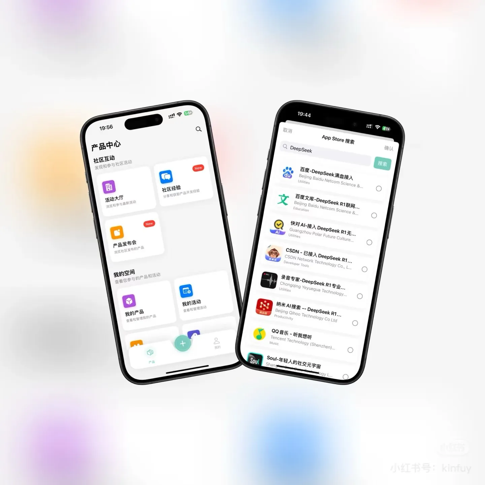

# AppTune

[](https://swift.org)
[](https://developer.apple.com/ios/)
[](https://developer.apple.com/xcode/swiftui/)
[](LICENSE)

Dedicated to being the best companion for independent developers

[简体中文](./README_ZH.md)
[English](./README_EN.md)

## 📱 Project Overview

AppTune is an iOS application specifically designed for independent developers, providing comprehensive development tools and services. Built with modern SwiftUI architecture, it offers users a smooth and intuitive experience.



## ✨ Key Features

### 🛠️ Development Tools
- **App Management**: Unified management of all your app projects
- **Product Services**: Product publishing and update management
- **Activity Management**: Marketing and promotional campaign management
- **Community Features**: Developer community communication platform

### 💰 Commercialization Support
- **Virtual Currency System**: Built-in virtual currency management
- **Promotion Services**: Flexible promotional campaign configuration
- **Notification System**: Real-time message push services

### 🎯 User Experience
- **Onboarding Interface**: New user guidance experience
- **Tag System**: Intelligent content categorization
- **Empty State Handling**: Elegant empty state display
- **Loading States**: Smooth loading animations

## 🏗️ Technical Architecture

### Core Technology Stack
- **SwiftUI 4.0+**: Modern declarative UI framework
- **Swift 5.9**: Latest Swift language features
- **iOS 15.0+**: Support for the latest iOS versions
- **Core Data**: Local data persistence
- **SwiftDate**: Date and time processing library

### Project Structure
```
Apptune/
├── ApptuneApp.swift          # Application entry point
├── Screen/                   # UI Layer
│   ├── User/                # User-related interfaces
│   ├── Product/             # Product-related interfaces
│   ├── Community/           # Community interfaces
│   ├── Coin/               # Virtual currency interfaces
│   ├── Apps/               # App management interfaces
│   ├── Active/             # Activity interfaces
│   ├── Notification/       # Notification interfaces
│   └── Common/             # Common interfaces
├── Services/                # Service Layer
│   ├── User+Service.swift
│   ├── Product+Service.swift
│   ├── Community+Service.swift
│   ├── CoinService.swift
│   ├── Active+Service.swift
│   ├── Notification+Service.swift
│   ├── Promotion+Service.swift
│   └── Tag+Service.swift
├── Components/              # Component Layer
│   ├── Sheet/              # Modal components
│   ├── Notice/             # Notification components
│   └── Various UI components
├── Router/                  # Router Layer
├── Apis/                    # API Interface Layer
├── Shared/                  # Shared Resources
└── Assets.xcassets/         # Asset files
```

## 🚀 Quick Start

### Requirements
- Xcode 15.0+
- iOS 15.0+
- Swift 5.9+

### Installation Steps

1. **Clone the project**
```bash
git clone https://github.com/your-username/AppTune.git
cd AppTune
```

2. **Open the project**
```bash
open Apptune.xcodeproj
```

3. **Configure the project**
   - Select the correct developer account in Xcode
   - Update the Bundle Identifier
   - Configure necessary permissions and certificates

4. **Run the project**
   - Select target device or simulator
   - Click the run button or use shortcut `Cmd+R`

## 📦 Dependency Management

The project uses Swift Package Manager for dependency management:

- **SwiftDate**: Date and time processing
- Other dependencies can be found in Xcode project settings

## 🎨 Design Features

### Modern UI Design
- Follows iOS Human Interface Guidelines
- Supports dark mode
- Smooth animation effects
- Responsive layout

### User Experience
- Intuitive navigation system
- Smart onboarding flow
- Elegant error handling
- Accessibility support

## 🔧 Development Guide

### Code Standards
- Follow Swift API Design Guidelines
- Use SwiftLint for code inspection
- Maintain complete code documentation

### Architecture Pattern
- Adopts MVVM architecture pattern
- Uses SwiftUI's declarative programming
- Separates service layer from UI layer

### Testing
- Unit tests cover core business logic
- UI tests ensure normal interface interactions
- Integration tests verify end-to-end processes

## 🤝 Contributing

We welcome all forms of contributions!

### How to Contribute
1. Fork this project
2. Create your feature branch (`git checkout -b feature/AmazingFeature`)
3. Commit your changes (`git commit -m 'Add some AmazingFeature'`)
4. Push to the branch (`git push origin feature/AmazingFeature`)
5. Open a Pull Request

### Types of Contributions
- 🐛 Bug fixes
- ✨ New feature development
- 📝 Documentation improvements
- 🎨 UI/UX optimization
- ⚡ Performance optimization
- 🔧 Code refactoring

## 📄 License

This project is licensed under the [MIT License](LICENSE).

## 🙏 Acknowledgments

Thanks to all developers who have contributed to this project!

## 📞 Contact Us

- Project Homepage: [GitHub Repository](https://github.com/your-username/AppTune)
- Issue Reports: [Issues](https://github.com/your-username/AppTune/issues)
- Feature Suggestions: [Discussions](https://github.com/your-username/AppTune/discussions)

---

⭐ If this project helps you, please give us a star! 
